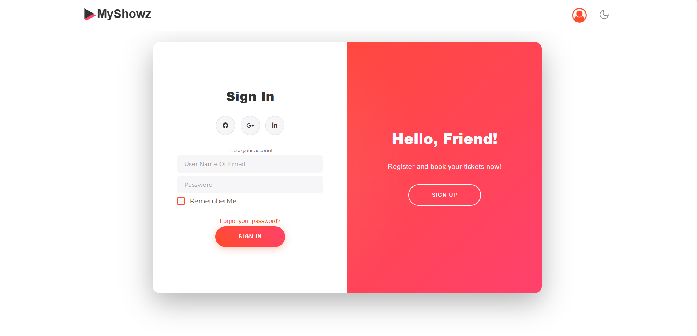
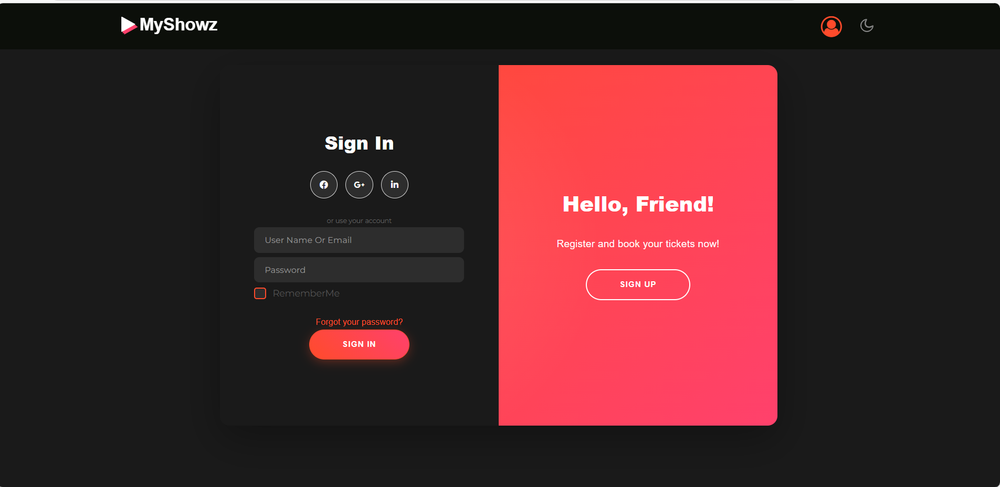
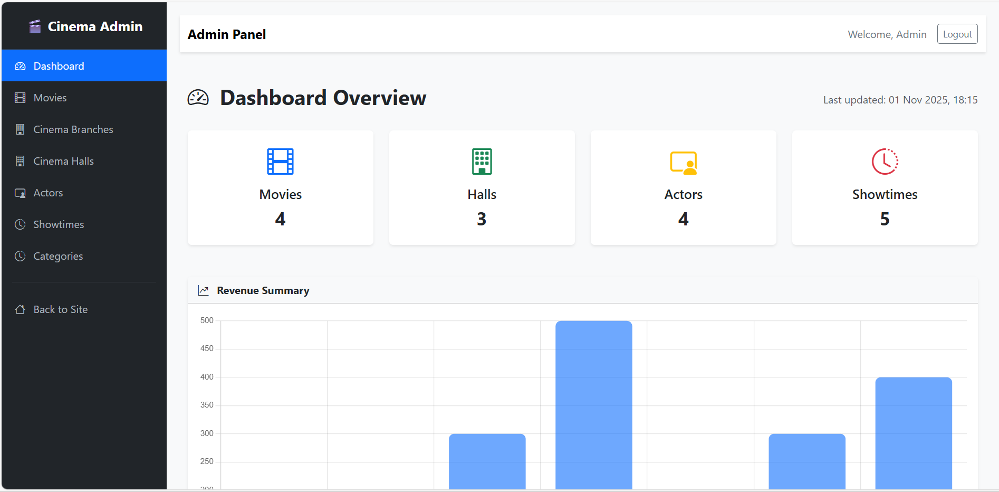

# 🎬 Cinema Management System

A complete web application built with **ASP.NET Core MVC** that manages all cinema operations — from movies and actors to branches, halls, and showtimes.  
The system also includes a user registration and authentication process with **email confirmation**.

---

## 🎥 Live Demo

🎥 [Watch Demo Video](https://drive.google.com/drive/folders/1dMvtfQd3HSYOJwdwtDrCEDBIhC0cmHli?usp=sharing)


---

## 🖼️ Screenshots

### 🏠 Home Page
.png)

### 🔐 Login & Register




### 🧑‍💼 Admin Dashboard



---

## ✨ Main Features

- 🧑‍💻 **User Registration with Email Confirmation**
- 🔐 **Secure Login/Logout System**
- 🧾 **Admin Dashboard** for managing:
  - 🎬 Movies  
  - 🎭 Actors  
  - 🏷️ Categories  
  - 🏢 Cinema Branches  
  - 🎟️ Halls & Showtimes  
- 📧 **Email Verification using ASP.NET Identity**
- 🗄️ **Repository Pattern** for clean data access  
- 📱 **Responsive Front-End** with modern UI design  

---

## 🧰 Tech Stack

| Layer | Technology |
|-------|-------------|
| Front-End | HTML, CSS, JavaScript, Bootstrap |
| Back-End | ASP.NET Core MVC |
| Database | SQL Server |
| ORM | Entity Framework Core |
| Authentication | ASP.NET Identity |
| Architecture | Repository Pattern |
| Version Control | Git & GitHub |

---

## ⚙️ Installation Guide

Follow these steps to run the project locally 👇

1. **Clone the repository**
   ```bash
   git clone https://github.com/mohamedmustafa23/Cinema.git
   cd Cinema
